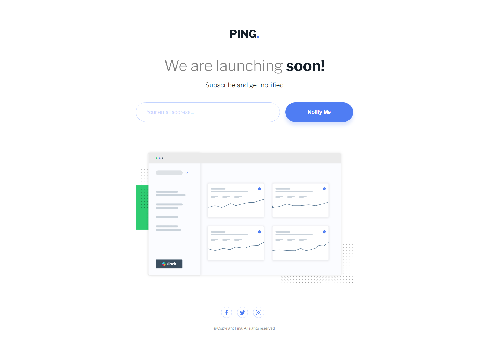

# Frontend Mentor - Ping coming soon page solution

This is a solution to the [Ping coming soon page challenge on Frontend Mentor](https://www.frontendmentor.io/challenges/ping-single-column-coming-soon-page-5cadd051fec04111f7b848da). Frontend Mentor challenges help you improve your coding skills by building realistic projects. 

## Table of contents

- [The challenge](#the-challenge)
- [Screenshot](#screenshot)
- [Links](#links)
- [Useful resources](#useful-resources)
- [Author](#author)

## The challenge

Users should be able to:

- View the optimal layout for the site depending on their device's screen size
- See hover states for all interactive elements on the page
- Submit their email address using an `input` field
- Receive an error message when the `form` is submitted if:
	- The `input` field is empty. The message for this error should say *"Whoops! It looks like you forgot to add your email"*
	- The email address is not formatted correctly (i.e. a correct email address should have this structure: `name@host.tld`). The message for this error should say *"Please provide a valid email address"*

## Screenshot

## Links

- Solution URL: [GitHub Repository](https://github.com/joangute/ping-coming-soon-page/)
- Live Site URL: [GitHub Pages](https://joangute.github.io/ping-coming-soon-page/)

## Useful resources

- [Filter Generator](https://codepen.io/sosuke/pen/Pjoqqp) - This codepen generates a target color from black.
- [SVG Icons](https://www.iconfinder.com/) - This site has free svg icons.

## Author

- Frontend Mentor - [@joangute](https://www.frontendmentor.io/profile/joangute)